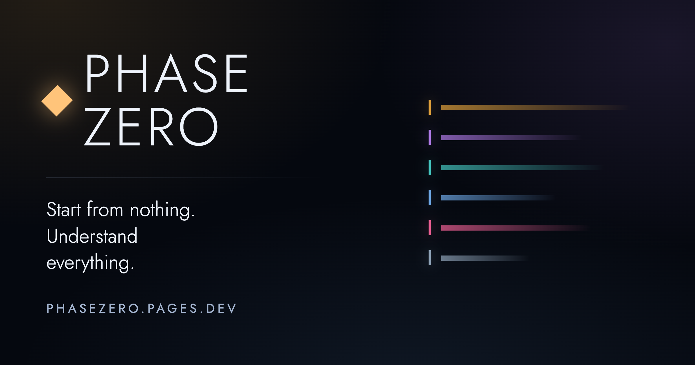

<p align="center">
  <a href="https://phasezero.pages.dev">
    
  </a>
</p>

<p align="center">
  An open, multilingual guide to the Marvel cinematic universes.<br />
  <strong><a href="https://phasezero.pages.dev">Read it at phasezero.pages.dev</a></strong>
</p>

<p align="center">
  <strong>English</strong> · <a href="README.it.md">Italiano</a>
</p>


> [!NOTE]
> Every colour above is a saga, and it is the same colour wherever a title from
> that saga appears on the site. The card and the bar are generated from the
> project's own design tokens, which is why nothing here is borrowed artwork.

## What is in it

Counted on 8 September 2026. The site's colophon counts the same things live.

| | | | |
|---|---|---|---|
| **161** titles | **102** characters | **47** glossary terms | **12** organisations |
| **9** collections, 90 pieces | **9** watch paths | **24** questions answered | **5** guides |
| **528** sources, opened and read | **2** languages, both complete | **583** static pages | **0** third-party scripts |

---

## What this is

Phase Zero explains the Marvel Cinematic Universe and the two connected
universes made by other studios: the Fox X-Men and Deadpool films, and Sony's
Spider-Man and Venom films. Together that is more than a hundred and twenty
films and series made over almost twenty years, released in one order and set in
another, by three companies that did not always plan to be connected.

It is not a list. Lists already exist. This is a guide that explains: what to
watch and in which order, but also why a character becomes who they are, how the
stories connect, what "multiverse" actually means, and what you can safely skip.

When a new film comes out, the watch order here is updated and published.

## Who it is for

Two people at once, and this shapes every decision in the project.

**Someone who has never seen any of it** and is looking at a wall of a hundred
and twenty titles wondering where the door is.

**Someone who has seen all of it** and wants to know why a date in one series
contradicts a line in a film, or which source says what.

Both read the same page. Nothing is dumbed down, and nothing assumes you already
know. Every entry is layered: a plain sentence for the newcomer, a normal read
in the middle, and collapsible blocks holding the depth an expert came for.

## Choices, and why we made them

Most of these look like small technical decisions. They are the reasons the
project can be trusted and can grow, so they are worth writing down.

### Facts and prose are kept apart

`data/` holds what does not change between languages: dates, runtimes, phase
numbers, chronological order, relationships between entries, actor names.
Written once, used by every language.

`content/<code>/` holds what has to be translated: synopses, biographies,
glossary definitions, guides, interface strings.

The alternative, one file holding both, means a translator has to edit a file
full of dates they must not touch, and a date correction has to be applied
separately in every language. This split makes translation safe and fact
correction cheap.

### One file per entity

One film is one file. One character is one file.

The earlier private version of this project kept all films in a single file of
almost three thousand lines. That works for one person. For a public project it
does not: two people editing two different films collide on the same file, and a
reviewer cannot see what actually changed.

Now a pull request that fixes the runtime of one film touches one line of one
file, and reads in seconds.

### Pages are generated at build time, not assembled in the browser

Content lives in JSON, YAML and Markdown. Nobody writes HTML by hand, ever. The
build reads those files and generates a complete static page for every route in
every language.

The alternative is a single page that downloads a translation file and swaps the
text in the browser. It is simpler to set up and it is the wrong choice here.
Search engines index the page before that JavaScript runs, so translated
versions would effectively not exist to them. There would be no shareable URL
per language, the text would arrive late, and the site would be blank without
JavaScript.

Because pages are generated, every language has a real address, gets indexed,
loads instantly and works with JavaScript switched off. The files contributors
write are identical either way. Only the moment of assembly changes.

### A missing translation is a working state

If a page does not exist in your language yet, you get the English text with a
notice and a direct link to translate that exact file.

Nothing breaks while a language is incomplete, so a language can start with one
person translating the interface and grow from there. Every gap is an
invitation.

Adding a language means adding one entry to `config/languages.json` and creating
a directory. No code changes. If a language ever requires touching code, that is
a bug in the code.

### Every fact carries its source

Each entry in `data/` records where its facts came from and the date a human
last checked them.

This is what separates a reference from a fan blog, and it has a practical
effect on how the project runs: review becomes objective. A maintainer does not
need to know more than the contributor. They need to check that the source says
what the entry says.

When sources disagree, both are recorded and the disagreement is explained
rather than hidden. Those contradictions are real, and for the readers who care
most they are often the most interesting thing on the page.

### No third-party images

No posters, no studio logos, no promotional art, no screenshots.

Those are copyrighted. Hosting them would expose the project, and would force
everyone who forks it to inherit that exposure. Instead the visual identity is
built from vector artwork generated from the data in this repository.

There is a side effect we like: the site looks like itself, rather than like
every other site built out of the same publicity stills.

The single mark from outside is the GitHub logo in the footer, drawn as SVG in
this repository and used only to link back to here. The rule is about the films,
and about anything that is somebody else's to licence.

### Your progress stays in your browser

You can mark what you have already watched, and it is still there the next time
you open the site in the same browser. Working through a hundred and twenty
titles takes months, and losing your place every visit would make the guide much
less useful.

That is done entirely with browser storage. Nothing is sent anywhere, there is no
account to create, and the project never learns what you have watched. The
trade-off is worth stating plainly: clear your browser data or move to another
device and the marks are gone, because there is nowhere else they could have been
kept without collecting them. Moving your progress between devices is handled by
exporting a small file and importing it on the other side, which needs no server
and no account.

Everything else is static. No backend to maintain or pay for, no analytics that
identify anyone, and no third-party scripts that are not needed to draw the page.

### No emoji, no em dash

A house style, applied without exceptions.

The reason to have no exceptions is that it turns a matter of taste into
something a script can check, so it never has to be discussed in a review. The
build rejects both. Icons are SVG. An en dash is allowed between digits, as in
2008–2012.

### Two licenses

Code is MIT. Content is CC BY-SA 4.0.

Code should be as reusable as possible, so it is permissive. Content is
collaborative knowledge, so it stays open: you can use it anywhere, including
commercially, as long as you credit the project and keep adaptations under the
same license. This is the arrangement Wikipedia uses, for the same reason.

## Structure

```
config/     languages and site settings
data/       facts, one file per entity, language independent
  titles/
  characters/
content/    prose, one directory per language
  en/
  it/
src/        code, containing no hardcoded text
scripts/    the validation CI runs, and what the build writes afterwards
public/     files served as they are, including the preview cards
```

Here is one film across the whole system.

`data/titles/iron-man.yml`, written once for every language:

```yaml
id: iron-man
type: film
phase: 1
release:
  date: 2008-05-02
  runtime: 126
sources:
  - url: https://www.marvel.com/movies/iron-man
    accessed: 2026-09-07
verified: 2026-09-07
```

`content/en/titles/iron-man.md`, the prose:

```markdown
---
title: Iron Man
oneLine: A weapons manufacturer builds a flying suit of armor, then turns it
  against the weapons he sold.
---

Billionaire Tony Stark is captured in Afghanistan and escapes in an armored suit
he builds in captivity. Back home he refines it, and decides to stop making the
weapons that put him there.

:::detail{title="Why it matters"}
This is the film that established the shared-universe format, and the
post-credits scene is the first time that plan is stated out loud.
:::
```

`content/it/titles/iron-man.md` is the same shape with Italian sentences. A
translator copies the English file and translates it. No code involved.

## Running it locally

Node 20 or later.

```sh
git clone https://github.com/synaps3s/phase-zero.git
cd phase-zero
nvm use
npm install
npm run dev
```

The site is at http://localhost:4321.

Before opening a pull request:

```sh
npm run validate
```

You do not need any of this to fix a fact or translate a page. Those can be done
entirely from the GitHub website.

## Contributing

Everyone is welcome, including people who have never opened a pull request.

Read [CONTRIBUTING.md](CONTRIBUTING.md) for the full guide, or [CLAUDE.md](CLAUDE.md)
for the short version. [CODE_OF_CONDUCT.md](CODE_OF_CONDUCT.md) applies to
everyone taking part.

The smallest useful contribution is opening an issue about something that looks
wrong. That is genuinely helpful and costs you two minutes.

## Licenses

Code is [MIT](LICENSE). Content is
[CC BY-SA 4.0](LICENSE-CONTENT).

## Disclaimer

Phase Zero is an unofficial, fan-made project. It is not affiliated with,
endorsed by, or sponsored by Marvel Studios, The Walt Disney Company,
20th Century Studios, Sony Pictures, or any of their subsidiaries.

All film titles, series titles, character names and trademarks are the property
of their respective owners and are used here for identification and commentary.
